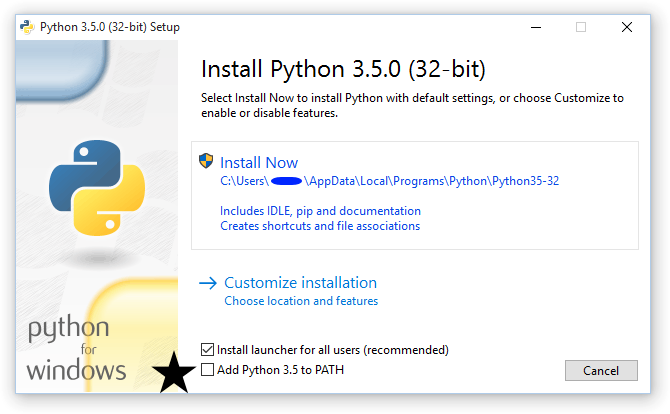

# Installing Python

If you need to install Python, here are some handy-dandy tips and links.

## Windows

For Windows x.x and up, Python comes preinstalled. For Windows x.x and lower,
you need to install Python manually.

1.  Go to [the Python download page](https://www.python.org/downloads/).

1.  Select Python 3.x or Python 2.x.

    
Note: I recommend Python 3.x.

     

1.  Open the installer.

1.  On the install screen, check the last two boxes on the installer window.

    

    
Important: Don't miss the last box, marked here with a black star!

     

1.  Once installation completes, open PowerShell and run the following command:

        python -V

<!-- ### Set up the path for the command

You aren't done! You need to set everything up so when you type `python` into
a command line client, you will get the expected output. To do this next set of
steps, you need to have either `PowerShell` or another command line client.
Since PowerShell is the most common, the next steps are written for
PowerShell.

1.  In the PowerShell app, run the following command.

        [Environment]::SetEnvironmentVariable("Path", "$env:Path;C:\Python27\)

1.  Restart PowerShell.

1.  Test your system by running the following command in PowerShell.

        python -V
 -->

## MacOS

In general, Python comes preinstalled on MacOS.

### Check your installation

Run the following command in your Terminal application.

    python -V

You likely will see Python 2.x.

### Install a different version

If you want to install a different version, the fastest way on MacOS is through
Homebrew.

1.  Go to the [Homebrew site](https://brew.sh/) and follow the directions to
   install Homebrew.

1.  In the Terminal app, run the following code.

        $ brew update
        $ brew install python3

    To install Python 2 instead of Python 3, use `brew install python2` instead.

## Linux

In general, Python comes preinstalled on Linux.

### Check your installation

Run the following command in your terminal.

    python -V

You likely will see Python 2.x.

### Install a different version

Run the following command in your terminal to get Python 3.x. Substitute
`python2` if you want Python 2.x.

    sudo apt-get install python3
